# 🚀 End-to-End MLOps Pipeline: Iris Classification


---

## 📋 Project Overview
This project demonstrates a robust **MLOps (Machine Learning Operations)** pipeline that automates the lifecycle of a Machine Learning model. It goes beyond simple model training by implementing **Continuous Integration (CI)**, **Continuous Delivery (CD)**, and **Containerization**.

The system trains a Random Forest classifier on the Iris dataset, packages it into a Docker container, and deploys it as a scalable API to the cloud.

---

### 🏗️ Engineering Architecture
The following diagram illustrates the automated pipeline triggered by every code push:

```mermaid
graph TD
    A[🧑‍💻 Local Dev] -->|git push| B(🐱 GitHub Repo)
    B --> C{⚙️ GitHub Actions}
    
    subgraph CI - Continuous Integration
    C -->|1. Test| D[🧪 Pytest & Linting]
    C -->|2. Train| E[🤖 Train Model Script]
    E -->|Artifact| F[💾 Model.pkl]
    end
    
    subgraph CD - Continuous Delivery
    C -->|3. Build| G[🐳 Docker Image]
    G -->|Publish| H[📦 GitHub Container Registry]
    end
    
    subgraph Deployment
    H -->|Pull| I[☁️ Render Cloud]
    I -->|Serve| J[🚀 Live API Endpoint]
    end
```


---
### 🛠️ Tech Stack

- Language: Python 3.9
- Framework: FastAPI (High-performance API)
- ML Library: Scikit-learn
- Containerization: Docker
- Orchestration: GitHub Actions (CI/CD)
- Artifact Store: GitHub Packages (GHCR)
- Cloud Provider: Render

---

### 🚀 How to Run Locally

Clone the repository:

```Bash
git clone [https://github.com/oscartma/Portfolio-MLOps.git](https://github.com/oscartma/Portfolio-MLOps.git)
cd Portfolio-MLOps
```

Install dependencies:
```Bash
pip install -r requirements.txt
```

Train the model:
```Bash
python src/train.py
```

This will generate a models/model.pkl file.
Start the API server:

```Bash
uvicorn src.app:app --reload
Test the API:
Open your browser at http://127.0.0.1:8000/docs to see the Swagger UI.
```

---

### 🐳 How to Run with Docker
To ensure reproducibility, you can run the application in an isolated container:

```Bash
# Build the image
docker build -t mlops-app .
```

# Run the container
docker run -p 8000:8000 mlops-app

---

# 📡 API Documentation
The API accepts data about an Iris flower and returns the predicted class (0, 1, or 2).

Endpoint: POST /predict

Example Request Body:

```Bash
JSON
{
  "sepal_length": 5.1,
  "sepal_width": 3.5,
  "petal_length": 1.4,
  "petal_width": 0.2
}
```

Example Response:

```Bash
JSON
{
  "class": 0
}
```
---

## 🔄 CI/CD Automation Details

The project includes two main workflows:

Quality & Training: Runs unit tests (pytest) and executes the training script to verify model convergence.

Docker Publish: Automatically builds the Docker image and pushes it to the GitHub Container Registry (GHCR) upon a successful merge to main.

Created by OscarTMa


